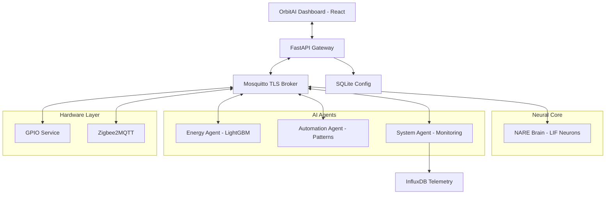

# NestShift OS: Neural Autonomous Residential Engine (NARE)

## 🎯 The Vision
**NestShift OS** is a premium, edge-first operating system designed to transform residential spaces into truly autonomous environments. Unlike traditional smart home hubs that rely on rigid "if-this-then-that" rules, NestShift utilizes a **Synthetic Neural Core** that learns and adapts organically to user behavior and energy markets.

---

## ✨ Core Pillars

### 1. 🧠 Neural Brain (NARE)
The heart of NestShift is the **Neural Autonomous Residential Engine**. It uses **Leaky Integrate-and-Fire (LIF)** neuron models and **Hebbian Learning (STDP)** to form synapses between sensors and devices. 
- **Learning**: "Neurons that fire together, wire together." If you manually turn on a light after a motion sensor fires, the Brain strengthens that connection.
- **Autonomy**: Once a synapse is strong enough, the Brain takes the action for you.
- **Explainability**: Every action has a "Neural Trace" explaining the trigger and synapse strength.

### 2. 🛡️ Safety & Integrity (Πsafe)
Security is immutable. No AI agent or user command can bypass the **Πsafe** hardware filter.
- **Hard Clamps**: HVAC is strictly capped at 16-26°C.
- **Grid Protection**: Maximum of 3 high-power devices (>1000W) can run simultaneously.
- **Sensor Coherence**: Detects and ignores "impossible" sensor jumps (e.g., temperature spiking 10°C in one second).
- **Inhibitory Control**: Critical appliances (ovens, stoves) are inhibited from autonomous activation.

### 3. ⚡ Edge Intelligence (Agents)
Specialized Python agents handle complex optimization tasks entirely on-device:
- **Energy Agent**: Uses **LightGBM** to forecast demand and integrates with **Octopus Agile** for real-time tariff optimization.
- **Automation Agent**: Learned behavior pattern recognition with probabilistic confidence scoring.
- **System Agent**: Monitors hardware health and detects **AI Model Drift** to trigger automatic retraining.

### 4. 💎 OrbitAI Dashboard
A high-end, glassmorphism-based UI built with **React + Vite + TailwindCSS**. 
- **Premium Aesthetic**: Deep blacks, neon cyan/green accents, and thin glowing borders.
- **Onboarding Wizard**: Native flow for Wi-Fi setup, mobile pairing, and hardware mapping.
- **Real-time Telemetry**: Live energy rhythm charts and interactive comfort-cost dials.

---

## 🏗️ System Architecture



---

## 🚀 Getting Started

### 🐳 Development Mode (Docker)
The fastest way to run the full stack for testing and development:

```bash
# Clone the repository
git clone https://github.com/NestShift/nestshift-os.git
cd nestshift-os

# Start the complete stack
docker-compose -f dev/docker-compose.dev.yml up -d

# Access the dashboard
# Open http://localhost:3000
```

### 🥧 Production OS Build
NestShift is designed to run as a custom OS on Raspberry Pi 4/5 or Jetson Nano.

```bash
# Build the custom OS image (requires Linux)
cd os/
./scripts/build-vm.sh  # Or use pi-gen manually
```

### 🧪 Running Tests
We maintain a 100% pass rate on all critical safety and logic tests.

```bash
pip install -r tests/requirements.txt
pytest tests/ -v
```

---

## 📁 Repository Map

- `dashboard/`: React web interface (OrbitAI aesthetic).
- `services/`: Microservices (API, Brain, Energy, Automation, System, GPIO).
- `os/`: Raspberry Pi OS build pipeline (`pi-gen` stage).
- `scripts/`: Installation, flashing, and setup utilities.
- `database/`: Schema and migrations for SQLite/InfluxDB.
- `mobile/`: Flutter client library for MQTT/REST integration.
- `tests/`: Integration tests for safety, drift, and learning logic.

---

## 🔒 Security & Privacy
- **Local-First**: 100% of data and processing stays in your home.
- **Encrypted**: All MQTT traffic uses TLS 1.3 with client certificates.
- **Authenticated**: REST API endpoints are protected by JWT tokens.
- **Safe**: Hardware-level constraints are hardcoded and immutable.

---

## 🤝 Contributing
NestShift is an ambitious project at the intersection of neuroscience and home automation. We welcome contributions to the NARE neural models and Πsafe safety logic.

*Built with ❤️ by NestShift Ltd for a sustainable, intelligent future.*
