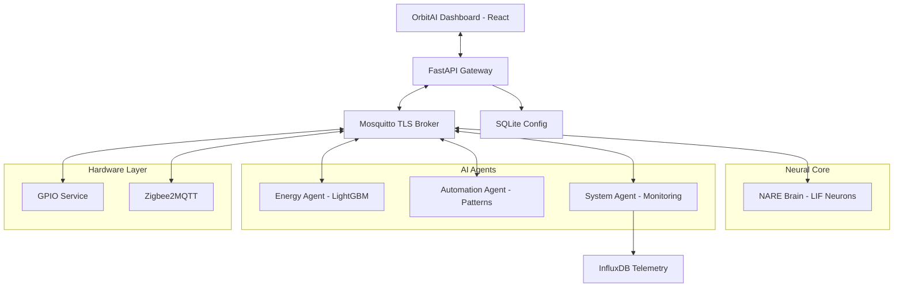

# NestShift OS: Neural Autonomous Residential Engine (NARE)

## The Vision

**NestShift OS** is a premium, edge-first operating system designed to transform residential spaces into truly autonomous environments. Unlike traditional smart home hubs that rely on rigid "if-this-then-that" rules, NestShift utilizes a **Synthetic Neural Core** that learns and adapts organically to user behavior and energy markets.

---

## Core Pillars

### 1. Neural Brain (NARE)

The heart of NestShift is the **Neural Autonomous Residential Engine**. It uses **Leaky Integrate-and-Fire (LIF)** neuron models and **Hebbian Learning (STDP)** to form synapses between sensors and devices.

- **Learning**: "Neurons that fire together, wire together." If you manually turn on a light after a motion sensor fires, the Brain strengthens that connection.
- **Autonomy**: Once a synapse is strong enough, the Brain takes the action for you.
- **Explainability**: Every action has a "Neural Trace" explaining the trigger and synapse strength.

### 2. Safety and Integrity (Pi-safe)

Security is immutable. No AI agent or user command can bypass the **Pi-safe** hardware filter.

- **Hard Clamps**: HVAC is strictly capped at 16-26 degrees Celsius.
- **Grid Protection**: Maximum of 3 high-power devices (greater than 1000W) can run simultaneously.
- **Sensor Coherence**: Detects and ignores "impossible" sensor jumps (e.g., temperature spiking 10 degrees in one second).
- **Inhibitory Control**: Critical appliances (ovens, stoves) are inhibited from autonomous activation.

### 3. Edge Intelligence (Agents)

Specialized Python agents handle complex optimization tasks entirely on-device:

- **Energy Agent**: Uses **LightGBM** to forecast demand and integrates with **Octopus Agile** for real-time tariff optimization.
- **Automation Agent**: Learned behavior pattern recognition with probabilistic confidence scoring.
- **System Agent**: Monitors hardware health and detects **AI Model Drift** to trigger automatic retraining.

### 4. OrbitAI Dashboard

A high-end, glassmorphism-based UI built with **React + Vite**.

- **Premium Aesthetic**: Deep blacks, neon cyan/green accents, and thin glowing borders.
- **Onboarding Wizard**: Native flow for Wi-Fi setup, mobile pairing, and hardware mapping.
- **Real-time Telemetry**: Live energy rhythm charts and interactive comfort-cost dials.

---

## AI Architecture

NestShift OS implements an LLM-orchestrated pipeline architecture - the same engineering principles used in enterprise AI systems (RAG pipelines, agentic systems, structured extraction), applied to home automation.

### Pipeline Stages

1. **Sensor Data Ingestion Layer**
   - MQTT subscription to all device topics (`nestshift/devices/#`, `nestshift/sensors/#`)
   - Real-time time-series storage in InfluxDB
   - Data normalization and feature engineering at 1-minute resolution

2. **Semantic Understanding and Intent Extraction**
   - Voice commands processed through **Whisper Small** for on-device ASR
   - Contextual intent extraction combining recent sensor state plus user history
   - Safety filter validation before any action reaches the decision engine

3. **Local AI Decision Engine**
   - **RL Agent**: BehaviourModel learns household patterns by recording device actions per hour-of-day. Confidence threshold determines when to act autonomously.
   - **Rule Fusion**: Safety filter (Pi-safe) provides immutable hardware constraints that no AI can bypass - HVAC temperature bounds, concurrent high-power device limits
   - Drift detection via SystemAgent monitors prediction error rates and triggers model retraining

4. **Structured Output Layer**
   - Device commands serialized as validated JSON
   - Action schemas: `{ device_id, action, params, rule_validated, safety_clamped }`
   - Published to MQTT for device execution

5. **Monitoring and Observability**
   - All agent decisions logged to InfluxDB for downstream analytics
   - Health topics published every 60 seconds per agent
   - SystemAgent aggregates drift status and model freshness

---

## System Architecture



---

## Hardware Stack

- **Raspberry Pi 5** - Primary compute platform (4GB or greater recommended)
- **Shelly 1PM** - WiFi relays with power monitoring
- **Danfoss Ally Zigbee TRVs** - Radiator temperature control
- **Aqara Sensors** - Temperature, humidity, motion, door/window
- **CT Clamp** - Non-invasive load monitoring for NILM

---

## Getting Started

### Development Mode (Docker)

```bash
# Clone the repository
git clone https://github.com/aryan597/nestshift-os.git
cd nestshift-os

# Start the complete stack
docker-compose -f dev/docker-compose.dev.yml up -d

# Access the dashboard
# Open http://localhost:8000
```

### Production OS Build

NestShift is designed to run as a custom OS on Raspberry Pi 4/5.

```bash
# Build the custom OS image (requires Linux)
cd os/
./scripts/build-vm.sh
```

### Running Tests

```bash
pip install -r tests/requirements.txt
pytest tests/ -v
```

---

## Project Structure

```
nestshift-github-ready/
├── dashboard/          # React web interface (OrbitAI aesthetic)
├── services/           # Microservices
│   ├── api/           # FastAPI Gateway
│   ├── brain/         # NARE Neural Core
│   ├── energy-agent/  # LightGBM plus Octopus
│   ├── automation-agent/ # Behaviour Learning
│   ├── system-agent/  # Monitoring plus Drift
│   ├── gpio/          # Raspberry Pi GPIO
│   ├── zigbee/        # Zigbee2MQTT
│   ├── mqtt/          # Mosquitto Broker
│   └── influxdb/      # Time-series DB
├── config/            # GPIO and Node-RED config
├── board/             # Buildroot overlay
├── scripts/           # Installation and flashing
├── systemd/           # Systemd units
└── tests/             # Safety and logic tests
```

---

## Security and Privacy

- **Local-First**: 100 percent of data and processing stays in your home.
- **Encrypted**: All MQTT traffic uses TLS.
- **Authenticated**: REST API endpoints protected by JWT tokens.
- **Safe**: Hardware-level constraints are hardcoded and immutable (Pi-safe).

---

## Research and Publications

This repository includes a complete digital twin simulation framework and two academic paper drafts derived from the NestShift architecture.

### Papers

- **`papers/version_a_conservative/`** — *A Multi-Agent, Local-First Edge AI Architecture for Autonomous Residential Energy Optimisation Under Dynamic Tariffs*. Conservative structure close to the original draft. Demonstrates 9–13% cost reduction across four tariff scenarios.
- **`papers/version_b_solar/`** — *SolarShift: A Local-First Edge AI Architecture for Solar Self-Consumption and Dynamic Tariff Arbitrage*. Higher-impact reframing with a Solar Forecasting Agent. Projects 12–38% savings for solar-equipped households.

### Simulation Framework

The `simulation/` directory contains a reproducible digital twin for evaluating multi-agent energy optimisation:

```bash
cd simulation/
python3 run_experiments.py          # Main Monte Carlo suite (4 tariffs × 4 controllers × 20 runs)
python3 analysis_learning_curve.py  # 90-day convergence analysis
python3 analysis_sensitivity.py     # Comfort-cost (λ) and risk (β) sweeps
python3 analysis_drift.py           # Behavioral drift detection scenario
```

Results are written to `simulation/results/`.

## Contributing

NestShift is an ambitious project at the intersection of neuroscience and home automation. We welcome contributions to the NARE neural models, Pi-safe safety logic, and the digital twin simulation framework.

[](https://doi.org/10.5281/zenodo.20426804)

*Built with care by NestShift Ltd for a sustainable, intelligent future.*
