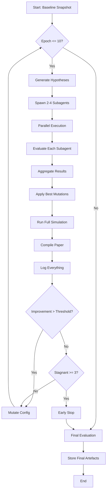
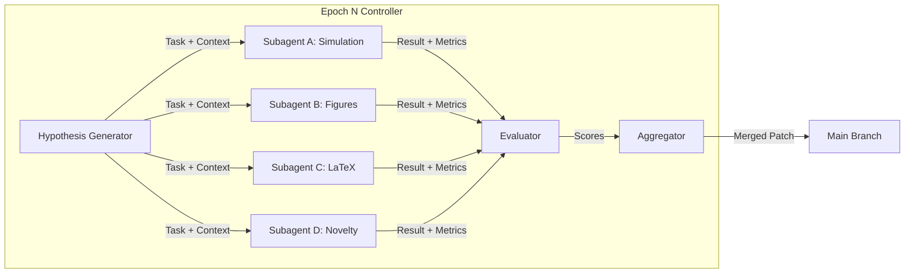
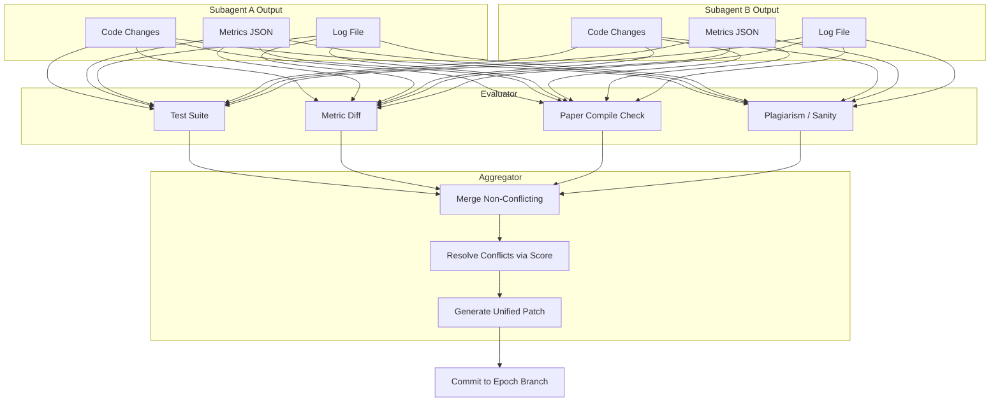

# Karpathy-Ralph Automated Experimentation Loop

> **Version:** 1.0  
> **Date:** 2026-05-26  
> **Project:** nestshift-os / paper_main.tex  
> **Objective:** Run 10 self-improving epochs over the simulation + paper pipeline. Each epoch spawns 2–4 subagents in parallel, evaluates their outputs, aggregates the best improvements, and mutates the next epoch's configuration.

---

## 1. Philosophy

This is a **meta-experimentation framework**. Instead of one-shot paper writing, we treat the entire research artifact (simulation code, figures, LaTeX) as a trainable system. Each "epoch" is a full forward pass:

```
Hypothesis → Parallel Subagents → Evaluation → Aggregation → Mutation → Next Epoch
```

Inspired by:
- **Andrej Karpathy's** "let the computer do the work" ethos (brute-force search in idea space).
- **Ralph loops** (recursive self-improvement via evaluation feedback).

The loop terminates when:
1. A target metric is reached (e.g., Proposed controller beats Rule-Based by >5%).
2. 10 epochs complete.
3. Diminishing returns detected (rolling improvement < 0.1% for 3 consecutive epochs).

---

## 2. Directory Structure

```
nestshift-os/
├── experiment.md              # This file
├── .experiment_logs/
│   ├── epochs/
│   │   ├── epoch_001/
│   │   │   ├── manifest.json       # What was attempted this epoch
│   │   │   ├── metrics.json        # Simulation results
│   │   │   ├── paper.pdf           # Compiled output
│   │   │   └── diff.patch          # Diff vs previous epoch
│   │   ├── epoch_002/
│   │   └── ...
│   ├── subagents/
│   │   ├── epoch_001_agent_A/      # Full workspace of subagent A
│   │   ├── epoch_001_agent_B/
│   │   └── ...
│   ├── aggregations/
│   │   ├── epoch_001_aggregate.json
│   │   └── ...
│   └── artefacts/
│       ├── baseline/               # Snapshot before loop starts
│       └── final/                  # Best epoch artefact
```

---

## 3. High-Level Flow (Mermaid)

### 3.1 The Outer Loop



### 3.2 Subagent Orchestration



### 3.3 Evaluation & Aggregation Flow



---

## 4. Epoch Protocol (Detailed)

### 4.1 Phase 0 — Baseline Snapshot (Epoch 0)

1. Copy current `simulation/`, `papers/`, `evals/` into `.experiment_logs/artefacts/baseline/`.
2. Run full simulation with current code → `baseline_metrics.json`.
3. Compile `paper_main.tex` → `baseline_paper.pdf`.
4. Store SHA-256 of all source files for integrity.

### 4.2 Phase 1 — Hypothesis Generation

The controller (this document + a driver script) analyses the previous epoch's metrics and generates 2–4 improvement hypotheses. Examples:

| # | Hypothesis | Target Metric |
|---|-----------|---------------|
| H1 | Wire `comfort_bias` (λ) into HVAC logic so Proposed differs from Rule-Based | Δ comfort penalty > 0.2 between controllers |
| H2 | Add battery storage model to create arbitrage opportunity | Proposed cost < Rule-Based cost on Agile |
| H3 | Replace fixed random seed in learning curve with per-day seeds | Learning curve std < 5% |
| H4 | Add solar forecasting + PV generation model | Cost reduction > 15% on dynamic tariffs |
| H5 | Rewrite Results section with new figures + tables | Paper compiles, figures referenced correctly |
| H6 | Fix drift detector false-positive rate | Alert delay < 5 days after true drift |

The controller selects hypotheses based on:
- **Impact score** (expected metric improvement)
- **Feasibility score** (estimated subagent success probability)
- **Diversity** (no two subagents should attempt the same file if possible)

### 4.3 Phase 2 — Subagent Spawn

Each epoch spawns **2 to 4** subagents. Roles are fixed; tasks vary by epoch.

#### Subagent A: Simulation Engineer
- **Scope:** `simulation/` codebase
- **Tasks:** Fix bugs, add models (battery, solar, EV), improve physics, tune hyperparameters.
- **Success criteria:** `pytest evals/` passes; simulation runs in < 60s; metrics JSON produced.

#### Subagent B: Visualisation & Data
- **Scope:** `papers/generate_figures.py`, matplotlib, data processing
- **Tasks:** Generate new figures, fix plotting bugs, improve aesthetics, add statistical overlays.
- **Success criteria:** All figures render as PDF+PNG; no clipping; fonts embedded.

#### Subagent C: Paper Writer
- **Scope:** `paper_main.tex`, bibliography
- **Tasks:** Rewrite sections, add tables, fix citations, ensure figure/table numbering.
- **Success criteria:** `pdflatex` compiles without errors; word count appropriate; no undefined refs.

#### Subagent D: Novelty / Architecture
- **Scope:** New modules, cross-cutting concerns
- **Tasks:** Add new agent types, refactor controller hierarchy, implement meta-learning, add new eval scenarios.
- **Success criteria:** New code has tests; integrates with existing pipeline; improves at least one metric.

**Subagent Prompt Template:**
```
You are Subagent [A/B/C/D] in Epoch [N] of the nestshift-os experimentation loop.

PREVIOUS EPOCH METRICS:
{metrics_json}

YOUR HYPOTHESIS:
{hypothesis_text}

CONSTRAINTS:
- Do not break existing tests in evals/
- All changes must be reversible (keep backups)
- Target metric must improve by > 0.5%
- Log all actions to .experiment_logs/subagents/epoch_N_agent_X/log.txt

OUTPUT:
1. Modified files (git diff format)
2. metrics.json from your changes
3. Brief rationale (< 200 words)
```

### 4.4 Phase 3 — Evaluation

Each subagent output is scored on a **5-dimensional rubric**:

| Dimension | Weight | Description |
|-----------|--------|-------------|
| `metric_delta` | 0.40 | Improvement in primary target metric vs baseline |
| `test_pass` | 0.20 | Fraction of eval suite passing (must be 1.0 to qualify) |
| `compile_ok` | 0.15 | Paper or code compiles without fatal errors |
| `diff_size` | 0.15 | Lines changed (penalise excessive churn; reward minimal surgical changes) |
| `rationale_quality` | 0.10 | Clarity and correctness of subagent's written rationale |

**Scoring formula:**
```python
def score(subagent_output):
    s = 0.0
    s += 0.40 * normalize(subagent_output.metric_delta)
    s += 0.20 * subagent_output.test_pass_rate
    s += 0.15 * (1 if subagent_output.compile_ok else 0)
    s += 0.15 * (1 / (1 + log(subagent_output.lines_changed)))
    s += 0.10 * subagent_output.rationale_quality
    return s
```

### 4.5 Phase 4 — Aggregation

1. **Filter:** Discard any subagent with `test_pass < 1.0` or `compile_ok == False`.
2. **Conflict Detection:** Check if modified files overlap between qualifying subagents.
3. **Merge Strategy:**
   - If no conflicts: apply all patches sequentially.
   - If conflicts: pick the highest-scoring subagent's version for each conflicting file.
   - If one subagent dominates (> 1.5× next best score): apply only that subagent's patch.
4. **Re-run full simulation** on merged codebase.
5. **Re-compile paper**.
6. If merged result is worse than best single subagent: rollback to best single subagent.

### 4.6 Phase 5 — Mutation for Next Epoch

The controller updates the next epoch's configuration based on results:

- **If improvement > 5%:** Continue in same direction (mutate hypothesis variants).
- **If 0.5% < improvement < 5%:** Explore orthogonal hypotheses.
- **If improvement < 0.5%:** Increase exploration (wider hypothesis search, more aggressive subagent prompts).
- **If stagnant for 3 epochs:** Inject a "disruptor" hypothesis (e.g., replace entire controller architecture).

---

## 5. Log Format

### 5.1 Epoch Manifest (`manifest.json`)

```json
{
  "epoch": 3,
  "timestamp_start": "2026-05-26T21:00:00Z",
  "timestamp_end": "2026-05-26T21:45:00Z",
  "hypotheses": [
    {"id": "H1", "text": "Wire comfort_bias into HVAC", "target": "comfort_penalty"},
    {"id": "H2", "text": "Add battery storage model", "target": "cost_reduction"}
  ],
  "subagents": [
    {"role": "A", "hypothesis": "H1", "score": 0.78, "accepted": true},
    {"role": "B", "hypothesis": "H2", "score": 0.92, "accepted": true},
    {"role": "C", "hypothesis": null, "score": 0.0, "accepted": false}
  ],
  "aggregation_strategy": "merge_no_conflict",
  "final_metrics": {
    "cost_reduction_agile": 0.128,
    "comfort_penalty": 1.15,
    "test_pass_rate": 1.0
  },
  "improvement_vs_baseline": 0.034
}
```

### 5.2 Subagent Log (`log.txt`)

```
[2026-05-26 21:05:12] START epoch=3 agent=A hypothesis=H1
[2026-05-26 21:06:45] ACTION modified simulation/controllers.py:142-156
[2026-05-26 21:08:10] ACTION modified simulation/agents/energy_agent.py:88-95
[2026-05-26 21:10:33] TEST evals/eval_energy_agent.py: 8/8 PASS
[2026-05-26 21:12:01] SIMULATION run_experiments.py: completed in 47s
[2026-05-26 21:12:02] METRICS {"cost_reduction_agile": 0.131, ...}
[2026-05-26 21:12:15] RATIONALE "Wiring λ into HVAC required exposing the parameter..."
[2026-05-26 21:12:15] END score=0.78
```

### 5.3 Final Artefact Manifest

At loop termination, `.experiment_logs/artefacts/final/` contains:
- `final_paper.pdf` — best-compiling paper across all epochs
- `final_paper.tex` — source of best paper
- `final_metrics.json` — best metrics achieved
- `epoch_provenance.json` — which epoch each improvement came from
- `README.md` — human-readable summary of the loop

---

## 6. Workflow JSON Spec (v1.0)

The driver script reads a `workflow.json` that parameterises the loop. Schema:

```json
{
  "version": "1.0",
  "max_epochs": 10,
  "early_stop": {
    "patience": 3,
    "min_improvement": 0.001
  },
  "subagents": {
    "count": { "min": 2, "max": 4 },
    "roles": ["A", "B", "C", "D"],
    "timeout_seconds": 1800
  },
  "evaluation": {
    "weights": {
      "metric_delta": 0.40,
      "test_pass": 0.20,
      "compile_ok": 0.15,
      "diff_size": 0.15,
      "rationale_quality": 0.10
    },
    "test_command": "python -m pytest evals/ -q",
    "sim_command": "python simulation/run_experiments.py",
    "compile_command": "pdflatex -interaction=nonstopmode paper_main.tex"
  },
  "hypothesis_generator": {
    "strategy": "rolling_best_plus_noise",
    "diversity_temperature": 0.7
  },
  "logging": {
    "dir": ".experiment_logs",
    "keep_subagent_workspaces": true,
    "compress_after_epoch": false
  }
}
```

---

## 7. Implementation Roadmap

| Step | Task | Owner |
|------|------|-------|
| 1 | Write `workflow.json` per spec above | User + AI |
| 2 | Implement `experiment_driver.py` (epoch loop, subagent spawn, evaluator, aggregator) | AI |
| 3 | Implement `hypothesis_generator.py` (reads metrics, proposes next hypotheses) | AI |
| 4 | Run Epoch 1 manually to validate protocol | User + AI |
| 5 | Automate subagent spawning via `Agent()` tool integration | AI |
| 6 | Run full 10-epoch loop | Automated |
| 7 | Write final `artefacts/final/README.md` | AI |

---

## 8. Quick Start (Manual Epoch 1)

```bash
# 1. Snapshot baseline
cp -r simulation papers evals .experiment_logs/artefacts/baseline/
python simulation/run_experiments.py > .experiment_logs/artefacts/baseline/metrics.json
pdflatex paper_main.tex && cp paper_main.pdf .experiment_logs/artefacts/baseline/

# 2. Spawn subagents (manual for now)
#    - Agent A: Fix comfort_bias bug in simulation/controllers.py
#    - Agent B: Add battery storage model
#    - Agent C: Rewrite Results section with new tables

# 3. Evaluate each
python -m pytest evals/ -q
python simulation/run_experiments.py
pdflatex paper_main.tex

# 4. Aggregate & commit best result
#    (see experiment_driver.py for automation)
```

---

*End of experiment.md v1.0*
